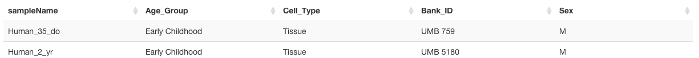

.. _basic_view:

.. toctree::
	:maxdepth: 2
	:numbered:

========================
Navigating the Browse-R
========================
This section provides a tour of the capabilities of the EDB.

Select a dataset
--------------------
Pick a dataset. Click "make active dataset". If you don't see a dataset, add one (see section on adding dataset).

.. figure:: images/select_dataset.png
	:width: 1024px
	:align: center
	:alt: select a dataset

 	Select a dataset

"Plot settings" panel
------------------------
The "Plot Settings" panel is the master panel to determine what region of the genome to view, how to bin/smooth/baseline samples, how to group/colour-code samples, and set axes.  

Here are the current available options:

Genome Location (left panel)
^^^^^^^^^^^^^^^^^^^^^^^^^^^^

After updating these values, click the refresh icon for changes to take effect.

+--------------------+----------------------------+
| field name         | purpose                    |
+====================+============================+
| sequence           | select from available      |
|                    | chromosomes                |
+--------------------+----------------------------+
| x-range, from/to   | coordinates for x-axis     |
|                    | units in bp, commas not    |
|                    | currently supported        |
+--------------------+----------------------------+
| Number of Bins:    | specifies the number of    |
|                    | bins in which the current  |
|                    | x-axis is broken up        |
+--------------------+----------------------------+
| Smooth bw (bp):    | smoothing bandwidth (uses  |
|                    | Gaussian kernel)           |
+--------------------+----------------------------+

Data and Grouping 
^^^^^^^^^^^^^^^^^^^

Some of these options result in an automatic refresh. Manually refresh for other options.

+--------------------+------------------------------------------------------------------------------------------------------+
| field name         | purpose                                                                                              |
+====================+======================================================================================================+
| Group samples by   | values are those speciifed                                                                           |
|                    | in dataset group_order                                                                               |
|                    | file. EDB adds additional                                                                            |
|                    | value of "(none)" which                                                                              |
|                    | results in showing sample-                                                                           |
|                    | level data                                                                                           |
+--------------------+------------------------------------------------------------------------------------------------------+
| Baseline trends    | sets whether samples are                                                                             |
|                    | shown as-is, or values are                                                                           |
|                    | divided by another value.                                                                            |
|                    | Options are:                                                                                         |
|                    |                                                                                                      |
|                    | * Sample-wise data (no baselining): sample data presented as-is                                      |
|                    | * Sample/Mean-of-all: each trace is itself divided by the mean of all traces                         |
|                    | * Sample/Mean-of-baseline: each trace is itself divided by the same trace selected to be a baseline  |
|                    | Depending on the value of ``Group samples by``, each trace is either a sample-level trace ("none") or|
|                    | a group-level trace                                                                                  |
+--------------------+------------------------------------------------------------------------------------------------------+

Plot Options
^^^^^^^^^^^^^
These changes result in an automatic refresh and a manual refresh should not be necessary.

+--------------------+------------------------------------------------------------------------------------------------------------------------------+
| field name         | purpose                                                                                                                      |
+====================+==============================================================================================================================+
| Plot type          | Data representation. Options                                                                                                 |
|                    | are:                                                                                                                         |
|                    |                                                                                                                              |
|                    | * Mean+CI: Group average with shaded 95% confidence interval bands. Only works when ``Group samples by`` is not ``(none)``.  |
|                    | * Points+Lines: Line showing bin-averaged trace along with individual data points.                                           |
|                    | * Points: Individual data points, no binning                                                                                 |
|                    | * Lines: Line showing raw trace                                                                                              |
|                    | * Smooth: Line showing smoothed trace                                                                                        |
+--------------------+------------------------------------------------------------------------------------------------------------------------------+
| Color by           | Setting to color traces. Options include all variables by which samples can be grouped (i.e. those found in                  |
|                    | ``group_order.txt``). This mode only works when ``Group samples by`` is set to ``(none)``.                                   |
+--------------------+------------------------------------------------------------------------------------------------------------------------------+
| Color scheme       | Color palette for determining trace colour. Palettes are from RColorBrewer, which in turn are based on ColorBrewer. Refer to |
|                    | ColorBrewer to pick a palette matching nature of data series (e.g. sequential versus divergent)                              |
|                    |                                                                                                                              |
|                    | *Note:  A number of palettes feature a very light value for the first item in the series. It is advisable to try a few       |
|                    | different palettes to make sure all traces are visible.*                                                                     |
+--------------------+------------------------------------------------------------------------------------------------------------------------------+
| Y-axis             | Determines if the y-axis limits are determined by EDB (``Default bounds``) or by the user (``Custom bounds``). When ``Custom |
|                    | bounds`` is selected, a slider appears to let the user set limits.                                                           |
+--------------------+------------------------------------------------------------------------------------------------------------------------------+
| show legend        | (checkbox) Toggles the legend at the bottom. Legend shows either sample or group names, depending on what individual traces  |
|                    | are showing.                                                                                                                 |
+--------------------+------------------------------------------------------------------------------------------------------------------------------+

Sample selector
----------------------
This panel provides a view of the :ref:`sample phenotype table <add-data-pheno>` as provided to EDB. 

Rows can be sorted by any column, by clicking the column header at the top.

 	Sample table showing column headers. Clicking on a column header reorders the table by the corresponding variable.

At present, the sample table only allows selecting of samples, and not deselection. This will change in future versions of EDB.

Samples can be selected using Ctrl-click (or Cmd+<space> in OS X). After selection, click the refresh icon to update the plot view.

Genome Annotation
---------------------
This panel shows a list of custom genome annotation available for the dataset genome. Refer to this section for instructions to :ref:`add custom annotation <add-anno>`.

.. figure:: images/anno_panel.png
	:align: center
	:alt:Custom annotation panel

*Note: The rendering of gene models by Gviz can slow down browser refreshes considerably. EDB automatically switches gene view from ``full`` to ``dense`` mode depending on width of viewed region. However, users are advised to turn on the gene models track, e.g. tracks like *RefSeq genes*, only when coordinates are reasonably refined.*

