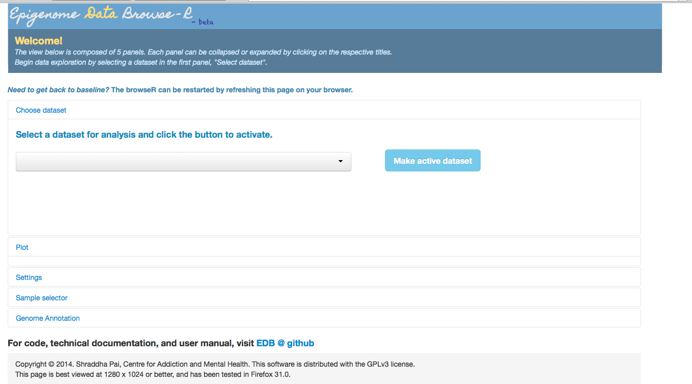

.. _install:

.. toctree::
	:maxdepth: 2
	:numbered:

=======================
Install instructions
=======================

This step only needs to be done once by the web administrator setting up the application. It does not have to be repeated by all endusers.
You will need access to a machine running a web server viewable to your users.

All EDB development has been done on Unix machines, but installation should work on any machine that can run Shiny server. 

The recommended machine configuration is

- OS: the EDB has been tested on Ubuntu 10.04, 12.04 and 14.04, but any machine that runs Shiny server should work.
- > 7 Gb RAM
- > 2 Gb disk; 2.0G is the size of all software dependencies and the demo dataset.

These instructions are for a machine running Ubuntu 14.04 (LTS). I have also successfully set up the app on Debian Wheezy LTS.
Each package will prompt saying something along the lines of "This package with require XYZ space. Continue [Y/n]?". Type "Y".

Clone the EDB repo
-------------------

Ignore the first line below if your machine already has git.

.. code-block:: none
	
	sudo apt-get install git
	git clone https://github.com/shraddhapai/shiny-data-browseR.git

Install R (>=3.1.0)
---------------------
.. code-block:: none

	sudo add-apt-repository ppa:marutter/rrutter
	sudo apt-get update
	sudo apt-get upgrade
	sudo apt-get install r-base r-base-dev

The following will set text-encoding preferences so your R error/status messages don't contain strange symbols.
In ~/.profile add the following line

.. code-block::  none

	export LC_ALL=C

Then execute ~/.profile:

.. code-block:: none

	. ~/.profile

Install shiny server
---------------------

First install the R shiny package:

.. code-block:: none

	sudo su - \
	-c "R -e \"install.packages('shiny', repos='http://cran.rstudio.com/')\""

Now download and install shiny-server:

.. code-block:: none

	sudo apt-get install gdebi-core
	wget http://download3.rstudio.org/ubuntu-12.04/x86_64/shiny-server-1.2.1.362-amd64.deb
	sudo gdebi shiny-server-1.2.1.362-amd64.deb

At this point, if you point your web browser to <myIpAddress>:3838, you should see a page like this. If you don't see this, shiny server has not been correctly installed. Debug this issue first.

.. figure:: images/shiny-server-worked.png
	:width:	500px
	:align: center
	:alt: Shiny server test page, viewed when browser point to <my-ip-address>:3838

Install Unix dependencies for the R/BioConductor packages
-----------------------------------

.. code-block:: none

	sudo apt-get install libcurl4-openssl-dev libxml2-dev

Install R and BioConductor packages
-----------------------------------

Start R (be sure to start as admin):

.. code-block:: none

	sudo R

Select your local mirror when prompted (e.g. 15 for Toronto)

.. code-block:: none

	install.packages(c("shinyBS","doMC","RColorBrewer","latticeExtra"))

Install BioConductor and package dependencies for the modified BioC package, "Gviz".

.. code-block:: none

	source("http://bioconductor.org/biocLite.R")
	biocLite(c("BioBase", "GenomicRanges", "rtracklayer", "GenomicFeatures","biovizBase","Rsamtools"))

Install customized "Gviz" package
------------------------------------
Now that all BioC dependencies have been installed, install the 'Gviz' package included in the EDB source tree. *This modified copy of Gviz is temporary. Future versions of EDB will get an updated version of Gviz directly from BioC.*

Exit R and insert the following at command line:

.. code-block:: none

	cd shiny-data-browser/dependencies
	sudo R CMD INSTALL Gviz

Configure EDB
------------------------------------

That's it! Installation is done. Now we configure the server.

.. code-block:: none
	
	cd /srv/shiny-server
	mkdir EDB
	sudo cp ~/shiny-data-browseR/*.R .
	sudo cp -r ~/shiny-data-browseR/www .
	sudo cp -r ~/shiny-data-browseR/data_types .
	sudo touch restart.txt

Now create a file named "config_location.txt" with the path to all your data configuration files. Save it. There should be no spaces before or after the path.  

.. code-block:: none

	/path/to/config/file/here

At this point, you should be able to see the EDB interface in your web browser. In the image below, config_location.txt points to a dummy directory with no config files. Therefore the dropdown box for "Select a dataset" is empty.

Great! Now let's proceed to adding our custom datasets.

	
	

	

